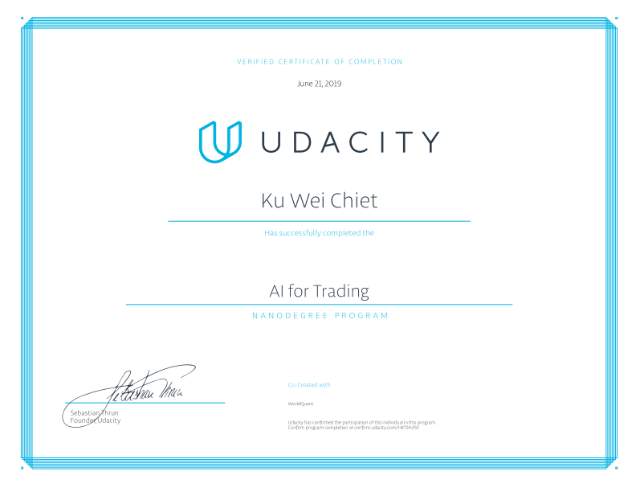

# Artificial Intelligence for Trading Nanodegree

## Program Description
In this program, you’ll analyze real data and build financial models for trading. Whether you want to pursue a new job in finance, launch yourself on the path to a quant trading career, or master the latest AI applications in quantitative finance, this program offers you the opportunity to master valuable data and AI skills.

[Graduation Certificate](https://confirm.udacity.com/HK72H292)

## Course Syllabus

### 1. Basic Quantitative Trading
Learn about market mechanics and how to generate signals with stock data. Work on developing a momentum-trading strategy in your first project.

**[Project 1: Trading with Momentum](./project_1/project_1_starter_completed.ipynb)**
* Implement a momentum trading strategy and test if it has the potential to be profitable.  
You will work with historical data of a given stock universe and generate a trading signal based on a momentum indicator. You will then compute the signal and produce projected returns. Finally, you will perform a statistical test to conclude if there is alpha in the signal.

### 2. Advanced Quantitative Trading
Learn the quant workflow for signal generation, and apply advanced quantitative methods commonly used in trading.

**[Project 2: Breakout Strategy](./project_2)**
* Code and evaluate a breakout signal.  
  You will run statistical tests to test for normality and to find alpha. You will also learn about the effect that filtered outliers could have on your trading signal and identify if the outliers could be a valid trading signal. You will make a judgement call about what should be kept versus what should not.  

### 3. Stocks, Indices, and ETFs
Learn about portfolio optimization, and financial securities formed by stocks, including market indices, vanilla ETFs, and Smart Beta ETFs.

**[Project 3: Smart Beta and Portfolio Optimization](./project_3)**
* Create two portfolios using smart beta methodology and optimization.  
  You will evaluate the performance of the portfolios by calculating tracking errors. You will also calculate the turnover of your portfolio and find the best timing to rebalance. You will come up with the portfolio weights by analyzing fundamental data and quadratic programming.

### 4. Factor Investing and Alpha Research
Learn about alpha and risk factors, and construct a portfolio with advanced optimization techniques.

**[Project 4: Alpha Research and Factor Modeling](./project_4)**
* Research and generate multiple alpha factors.    
  You will apply various techniques to evaluate the performance of your alpha factors and learn to pick the best ones for your portfolio. You will formulate an advanced portfolio optimization problem by working with constraints such as risk models, leverage, market neutrality, and limits on factor exposures.

### 5. Sentiment Analysis with Natural Language Processing
Learn the fundamentals of text processing, and analyze corporate filings to generate sentiment-based trading signals.

**[Project 5: Sentiment Analysis using NLP](./project_5)**
* Work with corporate 10Q and 10K filings and apply your newly-learned knowledge in Natural Language Processing, from cleaning data and text processing, to feature extraction and modeling.    
You will use bag-of-words and TF-IDF to generate company-specific sentiments. Then you will come up with trading strategies, and measure the performance of your strategies.  

### 6. Advanced Natural Language Processing with Deep Learning
Learn to apply deep learning in quantitative analysis and use recurrent neural networks and long short-term memory to generate trading signals.

**[Project 6: Deep Neural Network with News Data](./project_6)**
* Build deep neural networks to process and interpret news data.  
  You will play with different ways of embedding words into vectors. You will construct and train LSTM networks for classifying sentiments. You will run backtests and apply the models to news data for signal generation.  

### 7. Combining Multiple Signals
Learn advanced techniques to select and combine the factors you’ve generated from both traditional and alternative data.

**[Project 7: Combine Signals for Enhanced Alpha](./project_7)**
* Create a model for the S&P 500 and its constituent stocks by selecting a model for a large data set which includes market data, fundamental data and alternative data.  
 You will validate your model to ensure there is no overfitting. You will rank and select stocks to construct a long/short portfolio based on the prediction results.

### 8. Simulating Trades with Historical Data
Learn to refine trading signals by running rigorous back tests. Track your P&L while your algorithm buys and sells

**[Project 8: Backtesting](./project_8)**
* Construct an OHLC data feed and a backtesting framework.  
  You will learn about various visualization techniques for backtesting. You will construct trading strategies using various parameters such as trade days, take profit levels, stop loss levels, etc. You will then optimize the parameters and evaluate the performance by analyzing the results of your backtests.
